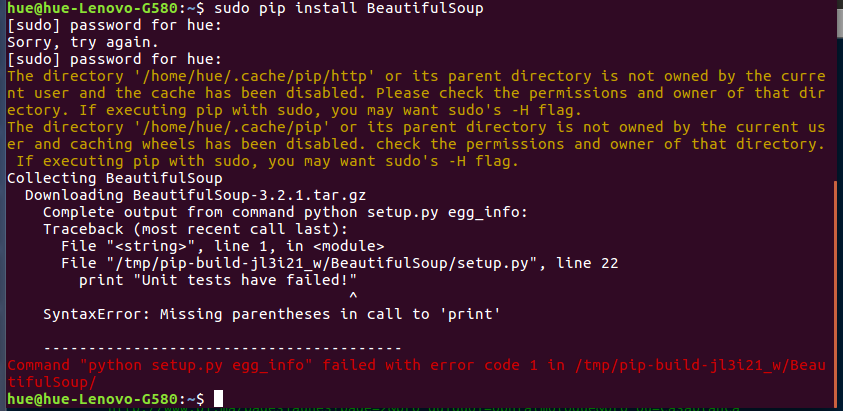

layout: true
  
<div class="my-footer"><span>
<a>Sociologia digital e métodos digitais de pesquisa</a>
</span></div>


---
class: middle, center
```{r setup, include=FALSE}
options(htmltools.dir.version = FALSE)

knitr::opts_chunk$set(
	echo = FALSE,
	fig.align = "center",
	message = FALSE,
	warning = FALSE,
	cache = FALSE
)
```

```{r eval=FALSE, include=FALSE}
library(knitr)
library(tidyverse)
library(widgetframe)
```

# Leonardo F. Nascimento

```{r out.width="15%"}
knitr::include_graphics("img/logos_bia.png")
```
15% Programador, 20% Químico, 25% Psicólogo, 40% Cientista Social

[Email: **leofn@ufba.br**](mailto:leofn@ufba.br) 

[Twitter:**@leofn3**](http://www.twitter.com/leofn3) 

[website: **www.leofn.com**](http://www.leofn.com)

---

class: middle, center  

```{r, out.width="30%"}
knitr::include_graphics("img/logo_MA_color.png")
```

# LABHDUFBA nas redes:


Twitter: [@labhdufba](https://twitter.com/labhdufba), 
  
  
Instagram: [@labhdufba](http://instagram.com/labhdufba)
  
  
Github: [https://github.com/LABHDUFBA](https://github.com/LABHDUFBA)
  
  
Youtube: [Clique aqui](https://www.youtube.com/channel/UCjUf9BsbG-C-gpA54zvOgBw)

---
class: inverse, center, middle

# O caminho para a sociologia digital

---
class: middle, center

# A "pré-história"...
<br>

--
## 2000 - Reflections on the Future of Sociology - Andrew Abbott
<br>
--

## 2007 - The Coming Crisis of Empirical Sociology - Roger Burrows & Mike Savage
<br>

--

## 2012 - A Ciência Social digitalizada: avanços, oportunidades e desafios - James Witte


---
class: middle, center

--
# A descoberta da sociologia digital
<br>

--
## 2013: Digital Sociology: critical perspectives - Nick Prior e Kate Orton-Johnson
<br>
--

## 2014: Digital Sociology - Deborah Lupton
<br>
--

## 2017: Digital Sociology - Noortje Marres
<br>
--

## 2019: Digital Sociology - Neil Selwyn
<br>

---
class: middle, center

# O digital na sociologia 
<br>

--
## objeto ("fato social total") 
<br>

--
## instrumentos e métodos de pesquisa
<br>

--
## plataforma


---
class: inverse, center, middle

# Para onde vai a pesquisa em ciências sociais em meios digitais?

```{r, out.width="60%"}
knitr::include_graphics("https://media.giphy.com/media/iTzWLKkXTyf3a/giphy.gif")
```


---
class: middle, center

## Estamos pesquisando cada vez mais com dados digitais

```{r, out.width="80%"}
knitr::include_graphics("img/dg.jpg")
```

A Web como repositório de dados digitais

---
class: middle, center

## Redes sociais digitais e plataformas

```{r, out.width="80%"}

```

---
class: middle, center

# Aos poucos (bem lentamente aqui no Brasil) estamos deixando de ser N00bs

```{r, out.width="60%"}
knitr::include_graphics("https://media0.giphy.com/media/CjmvTCZf2U3p09Cn0h/giphy-downsized.gif")
```


---
class: middle, center

# Incorporando técnicas de webscraping

```{r, out.width="85%"}
knitr::include_graphics("img/webscraping.png")
```
---
class: middle, center

# Incorporando técnicas de webscraping

```{r, out.width="85%"}

```

---
class: middle, center

# Incorporando linguagens de programação

```{r, out.width="75%"}
knitr::include_graphics("img/linguagens.jpg")
```

---
class: middle, center

# Incorporando aplicativos para análise dos dados 

```{r, out.width="100%"}
knitr::include_graphics("img/caqdas.png")
```

---
class: middle, center

# Nunca tivemos tantos dados, ferramentas, técnicas... 

```{r, out.width="85%"}
knitr::include_graphics("https://media.giphy.com/media/YnlDGfCxyOIYTDp86I/giphy.gif")
```

---
class: middle, center

# Nossos problemas NÃO acabaram 

```{r, out.width="85%"}
knitr::include_graphics("https://media.giphy.com/media/H0kxiS2RJF2HC/giphy.gif")
```

---
class: middle, center

# Desafios da pesquisa em ciências sociais em meios digitais
<br>

--
## fontes digitais da pesquisa
<br>

--
## métodos e técnicas digitais
<br>

--
## vigilância epistemológica do digital
<br>

---
class: middle, center
# Desafios das fontes da pesquisa
<br>

--
## **re-materialização**(Dominique VINCK, 2016:36) 
<br>

--
## publicidade/acessibilidade
<br>

--
## evocação versus coleta
<br>

--
## representatividade
<br>

--
## Pré-construção	algorítimica	dos	dados
<br>


---
class: middle, center
# Desafios das técnicas e métodos
<br>

--
## Letramento digital dos pesquisadores
<br>

--
## Pré-construção	algorítimica das ferramentas ("black-box")
<br>

--
## Cuidado com o soterramento! (download *versus* capacidade analítica)


---
class: inverse, center, middle

# Alguns aspectos da vigilância epistemológica da pesquisa em contextos digitais 


---
class: middle, center

# Um "erro no código" passa a constituir um "erro metodológico"

```{r, out.width="100%"}

```

---
class: middle, center

# "nossos ajudantes digitais já estão cheios de teoria e julgamento" (Bernhard Rieder and Theo Röhle in: BERRY, 2012, p. 70)

```{r, out.width="75%"}
knitr::include_graphics("img/bender.jpg")
```

---
class: middle, center

# “Não existe neutralidade metodológica das técnicas” 
(BOURDIEU; PASSERON; CHAMBOREDON, 2004, p. 55)

```{r, out.width="50%"}
knitr::include_graphics("img/bourdieu.jpg")
```

---
class: middle, center

# À guisa de conclusão: que fazer?
<br>

--
## Investir no letramento digital!
<br>

--
## Praticar ciência aberta: dados abertos, códigos abertos, ferramentas abertas;
<br>

--
## Abandonar o fetichismos dos dados, dos métodos e dos resultados

---

## Obrigado gente!
.pull-left[
```{r, out.width="100%"}
knitr::include_graphics("https://media1.giphy.com/media/3oz8xIsloV7zOmt81G/giphy.gif")
```
]

.pull-right[
**Agradecimentos especiais**:
- Profa. Carla Dieguez - Pelo convite!

]

